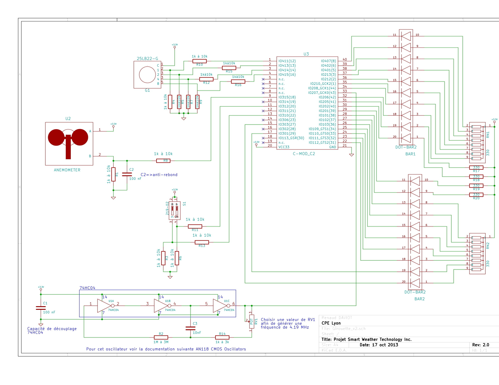

# Weather system prototype

The prototype is an electronic system allowing the display of data from a wind vane or anemometer. 

## Requirements
- A XC2C64A CPLD
- a mechanical encoder in GRAY code 25LB22-G from GrayHill, 
- a cup anemometer 
- two micro-switches
- two LED bars (bar-graph) type DC-10YWA from Kingbright, 
- resistors, capacitors and other laboratory components. 

## Schematic of the prototype

The CPLD XC2C64A is only available in a VQFP SMD package, so we will use a C-MOD_C2 board allowing wiring on a board. On this C-MOD_C2 board we find the CPLD, a regulator allowing to manage the component power supplies and a JTAG connector allowing its programming. 

Resistors are added to the mechanical encoder, to the anemometer and to the micro-switches, in order to ensure, on their outputs, logic levels allowing to correctly drive the CPLD. A filtering capacitor of the parasites is added to the anemometer. 

The schematic of the INVERTER oscillator is a classical schematic using 3 INVERTERS 74HC04, two resistors, a potentiometer and a capacitor. The frequency of the oscillator will be set at about 15 kHz. 

The 100 nF capacitor placed on the INVERTERS power supplies is a decoupling capacitor. The whole set is supplied in 3.3 V. 

## Project specifications

The project aims at realizing the prototype of an electronic weather system processing and displaying information from a wind vane and an anemometer. The selection between the display of the data from the wind vane or the anemometer will be done with a first switch.

For the wind vane, only 16 wind directions will be identified (N, N-NE, NE, E-NE, E,...). Each of these positions, captured with a mechanical encoder in GRAY code, will be visually indicated to the user with an illuminated LED. It will also be possible to visualize with the help of LEDs, either the Gray code, or the equivalent code in natural binary. This selection will be made with a second switch. 

For the anemometer, the LEDs will be used to indicate the intensity of the wind, ie its speed. The higher the wind speed, the more LEDs will be illuminated. 

The meteorological system to be realized is made up of 3 subsystems : 
- a subsystem ensuring the conditioning of signals from the analog input elements, 
- a subsystem ensuring the processing of information, 
- a subsystem allowing the visualization of output information. 

### Input subsystem
The rotation of the vane's arrow causes the rotation of the shaft of the mechanical encoder delivering a GRAY code on 4 bits. Thus, each position of the wind vane corresponds to a code among 16.

The analysis of the wind speed, measured by the cup anemometer, will be managed through sequential logic elements. These elements will be clocked by a square clock signal, with a duty cycle of 50% and a frequency between 10kHz and 20kHz. This signal will be obtained using an inverter oscillator. 

A first micro-switch will allow to choose between the GIROUETTE mode and the ANEMOMETER mode. A second micro-switch will be operational only in GIROUETTE mode and will allow to choose between the display of the GRAY code and the display of the NATURAL BINARY code. 

### Processing subsystem

The processing subsystem will be named weather_system and will be integrated in the XILINX CPLD XC2C64A. The component has 44 inputs/outputs and its number of macrocells is 64. 

The GRAY code obtained at the output of the mechanical encoder will be transcoded into NATURAL BINARY and each of the 16 possible combinations will be decoded in order to indicate the wind direction from the illumination of one LED among 16. The GRAY code or the NATURAL BINARY code will be displayed on 4 other LEDs. The signal from the cup anemometer will be processed to display the wind intensity on 20 LEDs. 

### Visualization subsystem

The visualization of the signals is ensured by two LED displays or bar-graph (2*10 LEDs). An LED will be illuminated when the signal to be visualized is in LOW state. 

## Appendix
### GRAY mechanical encoder
This mechanical encoder, 25LB22-G from Grayhill, is made of a disc rotating on 360° with a copper comb (see on the right of the picture). The teeth of this comb are put in contact with 5 electrical tracks of a printed circuit board (PCB). The tracks of this PCB have been designed to correspond to 5 concentric circles, 4 of which are discontinuous (see left of the picture). By a spring effect, each tooth of the comb is associated with one of the discs. The continuous circle in the center of the PCB is connected to a positive potential. In case of contact, a tooth of the comb will connect the central track to the corresponding track constituting a kind of switch. Thus, according to the design of the tracks, the voltage levels at the output of the mechanical encoder will evolve according to a Gray code type coding on 4 bits (16 possible positions). The position of the encoder is fixed from a ball and a spring. 

### Anemometer
The anemometer is a rotating device with cups. It consists of an "all or nothing" sensor connected to two wires. Depending on the position of the cups, the two wires will be connected together or not. 
